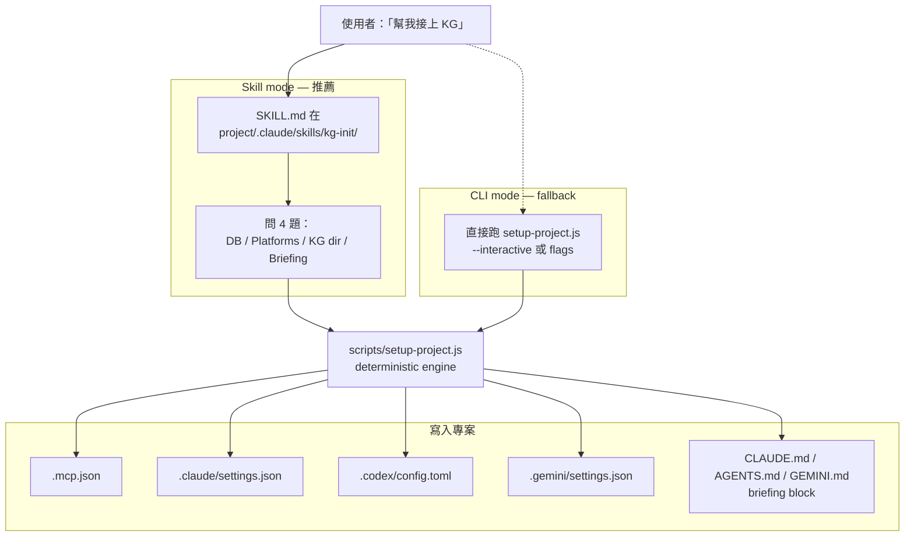

# kg-init Skill

把使用者「clone Multi-knowledgeGraph 到專案內 → 手刻 `.mcp.json` / `.claude/settings.json` / `.codex/config.toml` / `.gemini/settings.json`」這個流程包成一個 skill + 一個 deterministic engine,讓任何 LLM agent (Claude Code / Codex CLI / Gemini CLI) 都能無腦把 KG 接到當前專案。仿 AI_team_start_template 的 thin-skill + script-engine 分工。

> **v0.1 變更摘要**：initial draft。研究完成 Codex (`.codex/config.toml` TOML 格式) 跟 Gemini (`.gemini/settings.json` JSON 格式) 的 MCP 設定 schema。

## 目標

讓使用者把 KG clone 進專案後,只要說一句「幫我接上 KG」,agent 就能：

1. 問少量問題（DB 數量 / 啟用哪些 platform / KG 目錄位置 / 是否注入 briefing）
2. 寫入正確的 `.mcp.json`、`.claude/settings.json`、`.codex/config.toml`、`.gemini/settings.json`
3. 可選地在 `CLAUDE.md` / `AGENTS.md` / `GEMINI.md` 注入 briefing 區塊
4. 全程 **idempotent**——重跑不會壞資料,只會修正/補齊

**成功標準**：clone → 抄 skill → 跑 → 三家 CLI 都能看到 KG 工具且 hook 正常。

## 已定錨決策

| 項目 | 決策 | 來源 |
|------|------|------|
| Skill 分發方式 | 寫在 repo 內,README 中英文教使用者抄到專案 `.claude/skills/` | 上輪 Q1 |
| 涵蓋平台 | Claude Code + Codex CLI + Gemini CLI | 上輪 Q2 |
| DB 數量預設 | 預設 **single**（`knowledge.db`),互動詢問可選 multi-preset / custom | 上輪 Q3 |
| 架構 pattern | Thin SKILL.md（30 行）+ deterministic `setup-project.js` + `scripts/lib/*` 切小單元 | AI_team_start_template |
| Idempotency 機制 | JSON/TOML merge by key + markdown 區塊 markers + 跑完不刪既有設定 | AI_team_start_template |
| Hooks 綁定 | Claude hooks 只綁 primary DB (`knowledge.db` 或使用者指定的 main DB) | 上份 Multi-DB plan v0.2 |
| Codex/Gemini hooks | 不做（Codex/Gemini CLI 目前無 Claude Code 那種 hook 系統） | 平台限制 |
| Persona 注入 | 可選,預設 inject;用 `<!-- KG-BRIEFING:START -->` markers idempotent | AI_team_start_template |
| 路徑表示 | 設定檔內全用絕對路徑（IDE 從任何 cwd 啟都能找到） | 跨平台一致性 |
| 設定 placeholder | `{{KG_ROOT}}` 在 template 內,執行時替換成絕對路徑 | 同上 template |

## 核心策略 / 方法

### 兩條入口,一個引擎



### Repo 內檔案佈局

```
Multi-knowledgeGraph/
├── .claude/
│   └── skills/
│       └── kg-init/
│           └── SKILL.md          ← thin wrapper (~30 lines)
├── scripts/
│   ├── setup-project.js          ← engine (orchestrator only)
│   └── lib/
│       ├── args.js               ← parse CLI args
│       ├── exec.js               ← spawnSync wrapper with logging
│       ├── placeholders.js       ← {{KG_ROOT}}, {{PROJECT_ROOT}} substitution
│       ├── markers.js            ← idempotent markdown block insertion
│       ├── json-merge.js         ← idempotent .mcp.json / settings.json merge
│       ├── toml-merge.js         ← idempotent .codex/config.toml merge (string-level)
│       └── prompt.js             ← readline 互動 (CLI mode 用)
├── templates/
│   ├── claude/
│   │   ├── settings.json         ← with {{KG_ROOT}} placeholders
│   │   └── briefing.md           ← CLAUDE.md briefing snippet
│   ├── codex/
│   │   ├── config.toml.fragment  ← [mcp_servers.knowledge-graph] template
│   │   └── briefing.md           ← AGENTS.md briefing snippet
│   └── gemini/
│       ├── settings.json.fragment ← mcpServers fragment
│       └── briefing.md            ← GEMINI.md briefing snippet
└── README.md / README.zh-TW.md   ← documents skill mode + CLI mode
```

### 三家 CLI 的設定 schema

**Claude Code** (`.mcp.json`):
```json
{
  "mcpServers": {
    "knowledge-graph": {
      "command": "node",
      "args": ["{{KG_ROOT}}/main.js"]
    }
  }
}
```

**Codex CLI** (`.codex/config.toml`,project-level，trusted projects):
```toml
[mcp_servers.knowledge-graph]
command = "node"
args = ["{{KG_ROOT}}/main.js"]
```

**Gemini CLI** (`.gemini/settings.json`):
```json
{
  "mcpServers": {
    "knowledge-graph": {
      "command": "node",
      "args": ["{{KG_ROOT}}/main.js"]
    }
  }
}
```

Multi-DB 時,每個 DB 是一個獨立的 server entry,name 用 prefix（如 `knowledge-graph-main`、`knowledge-graph-research`）。

### 互動問題流程（Skill mode）

SKILL.md 用 AskUserQuestion 一次問完 4 題（max per call）：

| Q | 問題 | 選項 | 預設 |
|---|------|------|------|
| 1 | DB setup? | Single / Multi-preset (main+research+scratch) / Custom | **Single (Recommended)** |
| 2 | 啟用哪些 platforms? (multiselect) | Claude / Codex / Gemini | **Claude** 預設勾選 |
| 3 | KG 目錄相對於專案根的位置? | `./kg` / `./multi-knowledgeGraph` / 其他 | **./kg** |
| 4 | 注入 briefing 到 persona 檔? | Yes / No | **Yes** |

如果選 Custom DB,再問一次 DB 名稱清單。

## 步驟 / Roadmap

### Phase 1 — 建立 skeleton 與 lib 單元

- [ ] 建立 `.claude/skills/kg-init/SKILL.md`(先寫骨架)
- [ ] 建立 `scripts/setup-project.js`(orchestrator 殼)
- [ ] 建立 `scripts/lib/` 6 個檔案,先寫 signature + JSDoc
- [ ] 建立 `templates/` 樹（claude/codex/gemini 各放 fragment + briefing）

### Phase 2 — lib 單元實作

**`scripts/lib/args.js`**:解析 `--db`、`--platforms`、`--kg-dir`、`--no-briefing`、`--project-root`、`--interactive`、`--reset-git`。

**`scripts/lib/exec.js`**:`spawnSync` 包裝,印出 `→ <cmd>`,非 0 退出時 throw with stderr。

**`scripts/lib/placeholders.js`**:`substitute(str, vars)`、`hasPlaceholders(str)`,用正則 `{{[A-Z_]+}}`。

**`scripts/lib/markers.js`**:
```js
ensureBlock(content, startMarker, endMarker, body)
```
找不到 markers 就 append;找到就把中間替換成 body。Idempotent。

**`scripts/lib/json-merge.js`**:
```js
ensureMcpServer(filePath, serverName, serverConfig)
```
讀檔（不存在則 `{}`)→ 確保 `mcpServers[serverName] = serverConfig` → 寫回。其他 server 不動。

**`scripts/lib/toml-merge.js`**:Codex `config.toml` 沒有原生 TOML 套件,用「string-level merge」：
- 找 `[mcp_servers.knowledge-graph]` table heading
- 找到就替換到下一個 `[` 為止
- 找不到就 append
- 註解：未來如果加進相依套件可換 `@iarna/toml`,目前保持零 dep。

**`scripts/lib/prompt.js`**:`readline` 包裝給 CLI mode 用,Skill mode 用 AskUserQuestion 不會走這。

### Phase 3 — `setup-project.js` engine

```js
async function main() {
  preflight();              // node ≥18, KG repo exists, main.js exists
  const opts = parseArgsOrPrompt();  // flags > interactive prompts
  const projectRoot = detectProjectRoot(opts);
  const kgRoot = path.resolve(projectRoot, opts.kgDir);

  resetGitIfRequested(projectRoot, opts);  // only if --reset-git

  // Per-platform writes (each is idempotent + skippable)
  if (opts.platforms.includes('claude')) wireClaude(projectRoot, kgRoot, opts);
  if (opts.platforms.includes('codex'))  wireCodex(projectRoot, kgRoot, opts);
  if (opts.platforms.includes('gemini')) wireGemini(projectRoot, kgRoot, opts);

  summary(opts);
}
```

每個 `wireXxx`：
1. 從 `templates/<platform>/` 讀檔
2. 用 `placeholders.substitute` 替換 `{{KG_ROOT}}`
3. 用 `json-merge` / `toml-merge` 寫進專案的設定檔
4. 如果 `opts.briefing` → 把 briefing 區塊用 markers 插進 persona 檔

### Phase 4 — `SKILL.md` 薄包裝

仿 AI_team_start_template,內容大致：

```markdown
---
name: kg-init
description: Wire Multi-knowledgeGraph into this project (.claude/.codex/.gemini + .mcp.json)
---

You are wiring the Multi-knowledgeGraph repo into THIS project.

## Collect (one AskUserQuestion call, 4 questions)
1. DB setup: single (recommended) / multi-preset / custom
2. Platforms (multiselect): claude / codex / gemini
3. KG dir relative to project root (default: ./kg)
4. Inject briefing block? (default: yes)

If custom DB → ask again for comma-separated DB names.

## Run the engine

Build one command and run via Bash:
```
node {{kgDir}}/scripts/setup-project.js \
  --db <single|preset|custom:name1,name2> \
  --platforms <comma-separated> \
  --kg-dir <kgDir> \
  [--no-briefing]
```

## After it runs
- Relay engine's "Next steps" output
- On non-zero exit: report failing step verbatim,告訴使用者修完問題再重跑（idempotent）
- Don't hand-edit .mcp.json/.claude/settings.json/.codex/config.toml/.gemini/settings.json,re-run skill instead
```

### Phase 5 — README 更新（中英）

新增章節「One-command init via skill」：

**Skill mode (Claude Code)**：
```bash
# 1. clone 進專案
git clone https://github.com/ddwolfer/Multi-knowledgeGraph kg

# 2. 抄 skill 到專案
mkdir -p .claude/skills
cp -r kg/.claude/skills/kg-init .claude/skills/

# 3. 在 Claude Code: /kg-init
```

**CLI mode (任何環境)**：
```bash
node kg/scripts/setup-project.js --interactive
# 或一次給齊 flags
node kg/scripts/setup-project.js --db single --platforms claude,codex --kg-dir ./kg
```

### Phase 6 — 基礎測試

`scripts/lib/*.test.js` 簡單 unit test（用 `node --test`）：
- `args.js`：flag 解析正確、缺值給合理錯誤
- `placeholders.js`：替換 / 偵測剩餘 placeholder
- `markers.js`：append / replace 都 idempotent
- `json-merge.js`：既有 server 不被洗掉、新增 KG entry 正確
- `toml-merge.js`：append / replace table 都 idempotent

### Phase 7 — 驗證 + commit + push

驗證 checklist（見「驗證指標」）→ commit → push 到 `ddwolfer/Multi-knowledgeGraph`。

## 待 review 的開放決策

- [ ] **Q1**：Custom DB 名稱怎麼問? 一個輸入框 comma-separated,還是用 AskUserQuestion 多次?  
  建議：comma-separated 一次解決,簡單。
- [ ] **Q2**：`setup-project.js` 沒給任何 flag 也沒 `--interactive` 時應該怎樣?  
  選項：(A) 印 help 退出;(B) 預設走 interactive。建議 **A**（明確意圖優先,避免 Skill mode 卡住問題）。
- [ ] **Q3**：Codex CLI 的 `.codex/config.toml` 是 project-level（需要 trusted projects 設定）,還是寫到 `~/.codex/config.toml` 全域?  
  建議：**寫 project-level**,並在 summary 提醒使用者去 `~/.codex/trust.toml` 信任這個專案。全域寫法會污染所有專案。
- [ ] **Q4**：`AGENTS.md` 是 multi-agent 共用的（Claude/Codex 都讀）,要不要避免重複注入 briefing?  
  建議：每個檔案各注入一次,用不同 marker 名稱（`<!-- KG-BRIEFING-CLAUDE -->` vs `<!-- KG-BRIEFING-CODEX -->`）以避免衝突。或乾脆 briefing 只進 CLAUDE.md/GEMINI.md,AGENTS.md 留給 Codex 並警告共用風險。需要使用者決定。
- [ ] **Q5**：Skill mode 怎麼讓 SKILL.md 知道 KG 在 `./kg` 還是別的位置? 三選一：  
  (A) Skill 問使用者（已採用)  
  (B) Skill 自動偵測（找含 `main.js` 又含 `lib/embeddings.js` 的子目錄)  
  (C) 安裝時 sed 寫死路徑  
  建議：A+B,先嘗試偵測,偵測失敗才問。

## 不在範圍

- ❌ Codex / Gemini CLI 的 hook 等效系統（兩家都沒有 Claude Code 的 hook,不勉強做）
- ❌ 自動寫入 `~/.codex/trust.toml`（信任設定屬於使用者全域,setup script 不該動）
- ❌ Auto-upgrade（偵測既有 KG 設定版本,自動 migrate）—— v1 不做,使用者重跑 setup 就好
- ❌ Cross-platform 共用 KG state（讓 Claude / Codex / Gemini 看到同一個 DB 是天然的,不需要額外做）
- ❌ 自動 npm install KG 的相依（已有 `npm install` 指令,setup 不重複）
- ❌ 把 skill 變成 Claude Code plugin（infra 太重,v1 用「抄檔」方式）
- ❌ 動 `package.json` of 使用者專案（不該污染）

## 主要風險

| 風險 | 影響 | 緩解策略 |
|------|------|---------|
| Codex `.codex/config.toml` project-level 需要使用者「信任」此 project | 寫了但 Codex 不載入 | summary 提醒去 `codex auth trust .` 或編輯 `~/.codex/trust.toml` |
| TOML string-level merge 遇到怪 formatting | merge 失敗 / 重複 entry | 第一版只支援 `[mcp_servers.<name>]` 標準格式;遇到 multi-line array、註解內含 `[` 等 edge case → fallback 為「整段 mcp_servers.kg 區塊清空後重寫」 |
| 使用者把 skill 抄錯位置（沒在 `.claude/skills/`） | Claude Code 找不到 skill | README 明寫指令 + 在 SKILL.md 開頭做 sanity check (找不到 setup script 就明確錯誤) |
| 使用者改了 KG dir 位置忘了重跑 setup | 設定指向不存在的 main.js | KG 啟動時就會錯;hook 也會錯。Setup `--check` 子指令做後續健康檢查（v1 不做） |
| AGENTS.md 共用 briefing 衝突 | Claude 跟 Codex 互相 override | 採用 Q4 建議：分檔注入,不共用 |
| 跨平台路徑（Windows backslash vs POSIX） | 設定檔內路徑壞掉 | 全部用 POSIX forward slash（`.split('\\').join('/')`),Node 在 Windows 也能讀 |
| Reset-git 在 Windows 的 .git folder lock | rename 失敗 | 仿 AI_team_start_template:`renameSync` 失敗時提示「關 IDE/git 程序再重試」,操作 idempotent |

## 驗證 / 評估指標

執行完所有 phase 後跑這份 checklist：

**功能驗證（Claude）**
- [ ] 全新空專案跑 `node kg/scripts/setup-project.js --db single --platforms claude --kg-dir ./kg --no-briefing` → `.mcp.json` 含 `knowledge-graph`、`.claude/settings.json` 含 4 個 hooks
- [ ] 開 Claude Code → KG 工具可見、hooks 載入無錯誤
- [ ] 帶 `--db preset` → `.mcp.json` 含 3 個 entries（main/research/scratch）

**功能驗證（Codex）**
- [ ] `--platforms codex` → `.codex/config.toml` 含 `[mcp_servers.knowledge-graph]`
- [ ] `codex` CLI 啟動能看到 KG 工具（在 trusted project 下)

**功能驗證（Gemini）**
- [ ] `--platforms gemini` → `.gemini/settings.json` 含 `mcpServers.knowledge-graph`
- [ ] `gemini` CLI 啟動能看到 KG 工具

**Idempotency 驗證**
- [ ] 同樣指令連跑 3 次 → 設定檔 diff 為 0
- [ ] 使用者預先存在的其他 MCP server entry → setup 後仍存在
- [ ] briefing 區塊用 marker 包覆,重跑只更新區塊內,markers 外的內容不動

**Skill 驗證**
- [ ] 把 `.claude/skills/kg-init/` 抄到測試專案 → Claude Code `/kg-init` 看得到、能呼叫
- [ ] Skill 走完一次互動 → 落到 setup-project.js 帶正確 flags

**回歸驗證**
- [ ] Multi-knowledgeGraph 原本的 `node main.js` / `node main.js --db x.db` 行為不變
- [ ] 原本的 hooks 行為（auto-recall / session-start / post-compact）不變

**Repo 驗證**
- [ ] commit 訊息含 `feat: add kg-init skill + multi-platform setup engine`
- [ ] push 到 `ddwolfer/Multi-knowledgeGraph` 成功
- [ ] README en + zh 都有新章節

---

## 變更紀錄

**v0.1 (2026-05-29)** — initial draft。涵蓋 Claude/Codex/Gemini 三平台,thin-skill + script-engine 架構,5 個開放決策待 review。

---

**狀態**:草案 v0.1,等使用者 review 後 approve → 進入 execute 階段
