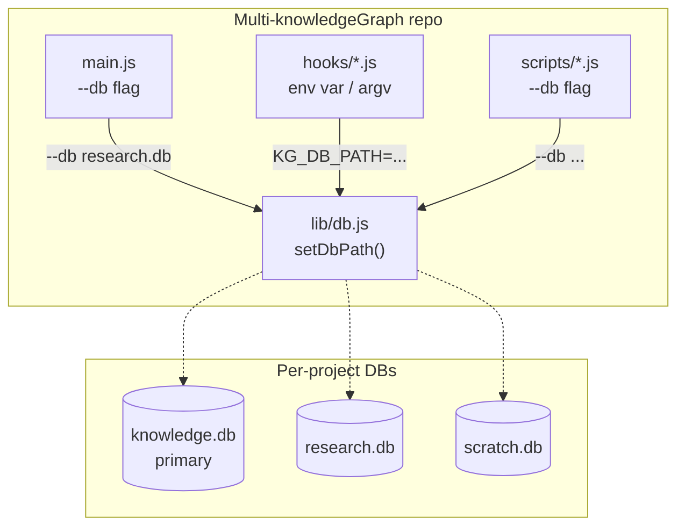

# Multi-knowledgeGraph

把現有 `knowledgeGraph` 切成獨立 repo `Multi-knowledgeGraph`，加入 `--db` flag 讓同一份程式碼可以在 `.mcp.json` 被多次註冊指向不同 DB 檔案，達成「同專案內多 KG」隔離（主 KG / 研究 KG / subagent scratch KG）。完全向後相容。

> **v0.2 變更摘要**：解決 v0.1 三個開放決策——attribution 只列 `ChenLiangChong/knowledgeGraph`、search-enforcer 維持全域 session flag（per-DB 狀態列入「不在範圍」）、首個 commit 訊息含 "forked from" 字眼。
>
> **v0.1**：initial draft。新 remote 已開好 `https://github.com/ddwolfer/Multi-knowledgeGraph`，採 `.git` reset 全新 history。

## 目標

在不破壞既有單 DB 使用者的前提下，讓單一 MCP server binary 透過 CLI flag 指向任意 DB 檔案。**成功標準**：

1. `node main.js`（無 flag）行為跟改動前一模一樣
2. `node main.js --db research.db` 寫入 `research.db`，不動 `knowledge.db`
3. `.mcp.json` 可同時註冊 N 個同程式碼但不同 DB 的 server，工具命名自然分流（`mcp__kg-main__*` vs `mcp__kg-research__*`）
4. Hooks 可指向特定 DB（透過 env var 或 CLI arg）

## 已定錨決策

| 項目 | 決策 | 來源 |
|------|------|------|
| 多 DB 機制 | CLI flag (`--db`)，不加 schema namespace 欄位 | 對話：彈性 vs 改動成本權衡 |
| Hook 預設 DB | 仍是 `knowledge.db`，可被覆蓋 | 主 KG 驅動自動化，其他 DB opt-in |
| 跨 DB 搜尋 | v1 不做 | YAGNI，保留簡單；要做之後再加 |
| Schema migration | 無 | 0 risk，無 backward incompatible 風險 |
| Embedding model | 每 process 各載一次（~560MB RAM × N） | IPC 共享太複雜，cost > value |
| 向後相容性 | 100% — 沒 flag 走原行為 | 既有專案完全不用動 |
| Git history | **Reset 全新**（user 決定） | 乾淨開始，attribution 靠 README |
| Repo 名稱 | `Multi-knowledgeGraph`（GitHub），`multi-knowledge-graph`（npm name） | 已開好 remote |
| README attribution | 只列原始上游 `ChenLiangChong/knowledgeGraph` | v0.2 Q1 |
| Search-enforcer 多 DB 行為 | 維持全域 session flag（搜過任一 KG 就算搜過） | v0.2 Q2 |
| 首個 commit 訊息 | 含 "inspired by / forked from" 字眼 | v0.2 Q3 |

## 核心策略 / 方法



### 設計關鍵：路徑解析

`setDbPath(p)` 接受相對或絕對路徑：
- 絕對路徑（`/foo/bar.db` 或 `C:\foo\bar.db`）→ 直接用
- 相對路徑（`research.db`、`./db/foo.db`）→ 解析為「相對於 repo 根目錄」

**為什麼相對於 repo 根目錄**：使用者目前的工作流是把整個 repo clone 到專案內，所以「相對於 repo」= 「相對於專案內的 kg 資料夾」，最直觀。

### `.mcp.json` 範例（給使用者）

```json
{
  "mcpServers": {
    "kg-main": {
      "command": "node",
      "args": ["./kg/main.js"]
    },
    "kg-research": {
      "command": "node",
      "args": ["./kg/main.js", "--db", "research.db"]
    },
    "kg-scratch": {
      "command": "node",
      "args": ["./kg/main.js", "--db", "scratch.db"]
    }
  }
}
```

主 agent 看到三組工具，根據場景選用。Subagent 繼承 parent MCP，所以也能用三個 DB——靠 prompt 約定（「研究類存進 kg-research」）就好，不用動態建 DB。

## 步驟 / Roadmap

### Phase 0 — Repo 切換（破壞性，先做完才繼續）

1. 備份目前 `knowledge.db`、`node_modules/`（兩者都在 .gitignore 內，不會被 commit 但本地可能想留）
2. `Remove-Item -Recurse -Force .git`（PowerShell；Bash 用 `rm -rf .git`）
3. `git init` + `git branch -m main`
4. `git remote add origin https://github.com/ddwolfer/Multi-knowledgeGraph`
5. 更新 README（見 Phase 3）+ `package.json.name`
6. 第一次 commit 訊息：
   ```
   feat: initial commit — inspired by / forked from ChenLiangChong/knowledgeGraph

   Adds --db flag for multi-database deployment, enabling per-domain
   or per-agent KG isolation within a single project.
   ```
7. `git push -u origin main`

### Phase 1 — `lib/db.js` 改造

把 module-level 常數 `DB_PATH` 改成 module-level mutable + setter：

```js
import path, { dirname, join, isAbsolute } from 'path';

let DB_PATH = join(__dirname, '..', 'knowledge.db');

export function setDbPath(customPath) {
  if (db) throw new Error('setDbPath must be called before getDb()');
  DB_PATH = isAbsolute(customPath)
    ? customPath
    : join(__dirname, '..', customPath);
}

export function getDbPath() { return DB_PATH; }  // for debug
```

呼叫處（`getDb()` 內）不變。

### Phase 2 — `main.js` 解析 flag

```js
import { parseArgs } from 'node:util';

const { values } = parseArgs({
  options: { db: { type: 'string' } },
  strict: false,
});

if (values.db) {
  const { setDbPath } = await import('./lib/db.js');
  setDbPath(values.db);
}
```

並在啟動 log 印目前 DB path，方便 debug：

```js
console.error(`[knowledge-graph] DB: ${getDbPath()}`);
```

### Phase 3 — Hooks（4 個檔案）

每個 hook 開頭加：

```js
const DB_PATH = process.env.KG_DB_PATH
  || process.argv[2]
  || join(__dirname, '..', 'knowledge.db');
```

優先序：env var > CLI arg > 預設。Env var 適合放 `.claude/settings.json` 的 hook env 配置；CLI arg 是 fallback。

涉及檔案：
- `hooks/session-start.js`
- `hooks/auto-recall.js`
- `hooks/post-compact.js`
- `hooks/search-enforcer.js`（這個只讀 flag 檔案，不開 DB，可能不用改——確認後再說）

### Phase 4 — Scripts（4 個檔案）

`scripts/backfill-decay.js`、`scripts/backfill-embeddings.js`、`scripts/seed-principles.js`、`scripts/import-skills.js`——全部加 `--db` 解析。用 `parseArgs` 跟既有 flag（`--fundamentals`）並存。

### Phase 5 — 文件

**README.md / README.zh-TW.md**：

頂部加 attribution：

```markdown
> Inspired by / forked from [ChenLiangChong/knowledgeGraph](https://github.com/ChenLiangChong/knowledgeGraph).
> 加入 `--db` flag 支援同專案內多個獨立 KG 資料庫。
```

新章節「Multi-DB Configuration」：
- 為什麼需要（同專案 multi-agent / multi-domain）
- `.mcp.json` 範例（上面那段）
- Hooks 怎麼指 DB
- 為什麼選 CLI flag 而非 schema namespace（簡短 tradeoff 說明）
- Subagent 使用範式（靠 prompt 約定即可）

**`package.json`**：
- `name`: `multi-knowledge-graph`
- `description`: 改成 multi-DB 版本

### Phase 6 — 驗證

依下方「驗證指標」逐項跑過。

## 待 review 的開放決策

_v0.1 三個 Q 已於 v0.2 全數解決（見「已定錨決策」表）。目前無新開放問題。_

## 不在範圍

- ❌ Schema 加 `namespace` 欄位（未來迭代可以；現在 CLI flag 已夠）
- ❌ 跨 DB 搜尋（要做時可加 `--include-dbs` 之類）
- ❌ 自動偵測 context 切換 DB（讓 agent explicit 指定）
- ❌ 動態建 DB（subagent 想要自己 DB → 預先在 `.mcp.json` 註冊）
- ❌ Embedding model 跨 process 共享（IPC > 收益）
- ❌ 把舊 `ddwolfer/knowledgeGraph` repo 刪掉（soft fork，兩個 repo 並存）
- ❌ 改動 `seeds.example.json`、改動 sqlite schema、改動 tools/* 介面
- ❌ Per-DB 獨立 search-enforcer 狀態（維持全域 session flag；多 DB 是進階用法，agent 自己負責搜對 KG）

## 主要風險

| 風險 | 影響 | 緩解策略 |
|------|------|---------|
| Hooks 在 settings.json 沒辦法傳 env var | 多 DB hook 不可行，要改用 CLI arg | 兩條路都支援；env > argv > default |
| 多 process embedding model RAM × N | 開太多 KG 吃記憶體 | 文件警告「實務上 2~3 個夠用」；不要無限開 |
| Subagent 寫錯 DB | 重要知識混進 scratch | 文件範式 + agent prompt 提醒；事後可用 forget + store 搬 |
| 既有 hook 設定沒帶 arg | 預期：仍走 `knowledge.db` ✅ | 預設邏輯保留，向後相容 |
| `parseArgs strict:false` 跟既有 script flag 衝突 | backfill-decay 的 `--fundamentals` 可能被誤解析 | `strict:false` + 明確 schema；Phase 4 個別測試 |
| Reset .git 失去 contribution history | Attribution 只剩 README | 接受（user 已決定）；README 寫清楚 |

## 驗證 / 評估指標

執行完所有 phase 後跑這份 checklist：

**功能驗證**
- [ ] `node main.js`（無 flag）寫入 `knowledge.db`，跟改動前行為一致
- [ ] `node main.js --db custom.db` 寫入 `custom.db`，不動 `knowledge.db`
- [ ] `node main.js --db /absolute/path/foo.db` 處理絕對路徑正確
- [ ] 兩個 process 各指不同 DB，並發 `store_knowledge` 不互相污染
- [ ] `node hooks/session-start.js` 讀 `knowledge.db`（向後相容）
- [ ] `KG_DB_PATH=custom.db node hooks/session-start.js` 讀 `custom.db`
- [ ] `node hooks/session-start.js custom.db` 讀 `custom.db`（CLI arg fallback）
- [ ] `node scripts/seed-principles.js seeds.json --db custom.db` 寫入 `custom.db`

**Repo 驗證**
- [ ] `git remote -v` 指向 `ddwolfer/Multi-knowledgeGraph`
- [ ] README 頂部包含 attribution 連結
- [ ] `package.json.name` = `multi-knowledge-graph`
- [ ] First commit pushed to main，repo 在 GitHub 可見

**回歸驗證**
- [ ] 既有的 12 個 MCP tool 全部正常運作
- [ ] 既有 hook 行為（auto-recall, search-enforcer 等）不變
- [ ] 既有 `.mcp.json` 沒改的話，啟動跟以前一樣

---

## 變更紀錄

**v0.2 (2026-05-29)** — 解決 v0.1 三個開放決策（attribution / search-enforcer / commit msg）。

**v0.1 (2026-05-29)** — initial draft。新 remote 已開好 `ddwolfer/Multi-knowledgeGraph`，採 reset .git + 全新 history 路線。

---

**狀態**：草案 v0.2，等使用者 review 後 approve → 進入 execute 階段
