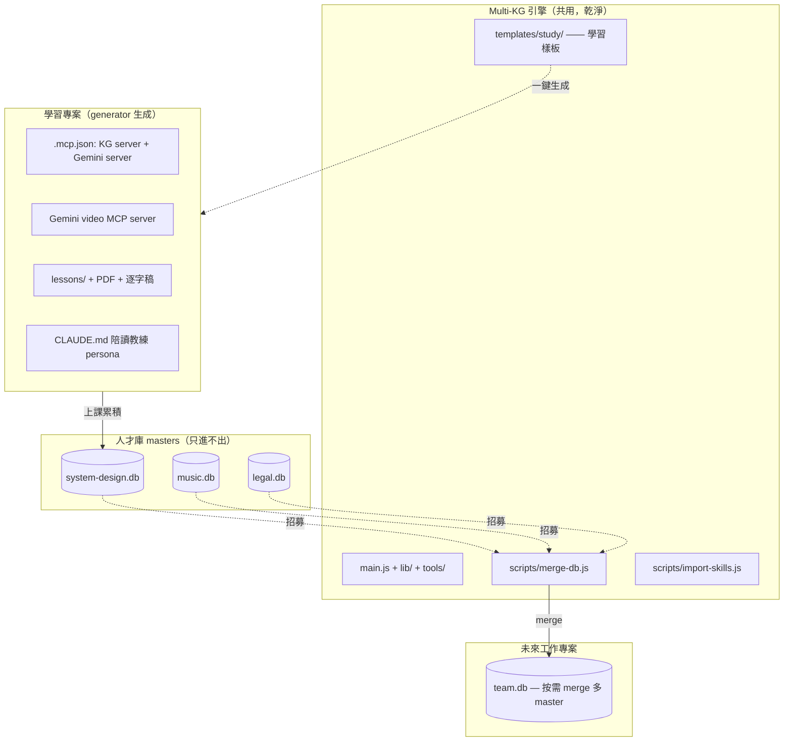
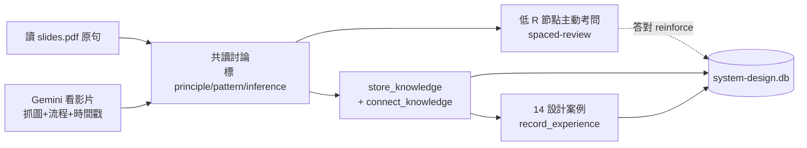

# Multi-KG 引擎完善 + 系統設計陪讀 scaffold

把 Multi-KG 從「一個帶音樂殘留、單庫思維的 KG server」升級成「**乾淨可攜的 KG 引擎 + 可一鍵生成的學習陪讀專案樣板**」。最終能邊上系統設計課邊把知識存進 `system-design.db`,日後當「人才庫 master」按需 merge 進任何新專案。

> **v0.1 變更摘要**:initial draft，兩輪結構（先完善引擎、再做學習 scaffold）。

## 目標

分兩輪交付，彼此解耦：

- **第一輪（引擎）**:讓 Multi-KG 真正「domain-agnostic + 可跨專案合併」。成功判準 = `merge-db.js` 能把兩份領域庫合成一份、向量/全文/圖三路搜尋跨領域都正常;且 `grep` 不到任何音樂字眼殘留。
- **第二輪（學習 scaffold）**:在 `templates/study/` 做出可重用的陪讀樣板（含即時 Gemini 影片 MCP server），用 generator 一鍵生成新學習專案。成功判準 = 生成的專案能同時啟動「KG server + Gemini server」,並完整跑通第一課的「讀 PDF/影片 → 討論 → 入庫 → 搜回」。

## 已定錨決策

| 項目 | 決策 | 來源 |
|------|------|------|
| 分隔原則 | 引擎 `scripts/` 只放純 KG 能力;課程/media 工具放 `templates/study/` 樣板化 | 對話：避免重蹈音樂耦合 |
| 混合 DB 模型 | 領域庫當 master，新專案按需 merge 出工作大腦 | 使用者選「混合玩法」 |
| merge 工具 | 新增 `scripts/merge-db.js`（ATTACH 多來源 → 複製 5 表 + 重建 fts + 打 domain tag + UUID 去重） | 引擎缺 export/merge |
| Gemini 整合形狀 | **即時 MCP 工具**（非離線 md）;獨立 Node MCP server，住學習樣板 | 使用者選「即時 mcp」 |
| Gemini 三工具 | `prepare_video`(上傳+48h快取) / `ask_video`(片段化問答) / `digest_lesson`(整課消化) | 含蓋離線用例 |
| 信任界線 | PDF 原句 = `principle`+quote;Gemini 轉述 = `pattern`+source 標時間戳;永恆真理 `category=fundamental` 永不衰退 | anti-fabrication 機制 |
| 學習 scaffold | 走 ① 樣板化進 `templates/study/` + generator 一鍵生成 | 使用者選「①」 |
| 節點語言 | `name` 用英文術語;`content`/`quote` 雙語 | 面試英文、教學中文 |
| spaced-review | 由陪讀 Claude 用 `list_knowledge sort=strength` 查低 R 節點主動考問（行為層，非程式） | 引擎無排程複習 |
| 平台 | Windows 11 / PowerShell;引擎 Node、Whisper 備案 Python | 環境 |

## 核心策略 / 方法

三層角色，互不汙染:

陪讀每堂課的 loop:

## 步驟 / Roadmap

### 第一輪 — 完善引擎

1. **`scripts/merge-db.js`** — CLI:`node scripts/merge-db.js --into team.db --from a.db --from b.db [--tag-domain]`。
   - 開 `--into`(載 sqlite-vec)，逐一 `ATTACH` 每個 `--from`。
   - 複製 `nodes / edges / episodes / episode_steps / vec_nodes`;`fts_nodes` 從複製後的 nodes 重建（避免直接搬 fts 影子表）。
   - `--tag-domain`:每來源節點 `metadata.domain` 寫入來源檔名（命名空間，方便日後「解雇」某領域）。
   - UUID 去重:已存在的 id 跳過並計數。
   - 安全:若任一 `--from` 旁存在 `-wal`/`-shm`，**拒絕執行並提示先關 server**（避免 WAL 漏資料）。
   - 結束印合併報告（每來源 nodes/edges/episodes 筆數、跳過數、最終總數）。
2. **領域去耦（cosmetic）** — 把音樂殘留換成中性/系統設計用語:
   - `main.js`:檔頭註解與 server `description` 的 "arrangement knowledge" → 中性描述。
   - 工具描述範例:`knowledge-tools.js` 的 `{element, genre, bpm, key}`、`search-tools.js`/`maintenance-tools.js` 的 `808/kick/hihat` → 換成 `{domain, component, layer, latency, service}` 之類系統設計範例。
   - `episode-tools.js` 的 `{bpm, key, genre, mood}` context 範例同樣中性化;`element` 欄保留但描述改為「元件/子系統」。
   - 不動 enum、schema、衰退邏輯（本來就中性）。
3. **引擎 README 更新** — 加:`merge-db.js` 用法與 WAL 注意事項;「如何另開一個學習/陪讀專案」章節（指向 generator）。

### 第二輪 — 學習專案 scaffold（`templates/study/` + generator）

4. **Gemini video MCP server**（`templates/study/mcp-gemini-video/`，Node） — 三工具:
   - `gemini_prepare_video(lesson)`:用 Files API 上傳影片、快取 file handle（48h），回傳就緒狀態。
   - `gemini_ask_video(lesson, question, start?, end?)`:對指定時間段提問;預設 Flash;回答含時間戳。
   - `gemini_digest_lesson(lesson)`:整課消化成結構化筆記（逐字 + 圖描述 + 架構演進 + 時間戳）;重點可切 Pro。
   - API key 走 `GEMINI_API_KEY` env;不寫入任何 DB/repo。
5. **Whisper 備案**（`templates/study/scripts/transcribe.py` + `.bat`） — 批次把 `lessons/**/*.mp4` 轉 `.srt`（`--language zh`）;用法寫進 study README。預設 `faster-whisper`，註明可換 `openai-whisper`。
6. **陪讀 persona**（`templates/study/CLAUDE.md`） — 定位 Claude 為「系統設計陪讀教練」:每課流程、信任分級規則、何時叫 Gemini、開場做 spaced-review。
7. **`lessons/` 結構 + 雙 server `.mcp.json` 範本** — `lessons/<NN-slug>/{slides.pdf, transcript.srt}`;`.mcp.json` 同時註冊 `knowledge-graph`(--db system-design.db 為 primary) 與 `gemini-video`。
8. **generator**（傾向新增 `scripts/init-study-project.js`） — 互動或帶旗標:指定目標資料夾與 DB 名 → 複製 `templates/study/*`、生成雙 server `.mcp.json` 與 `.claude/settings.json`(沿用既有 hook 接線)、提示使用者填 `GEMINI_API_KEY`。冪等。
9. **study README**（樣板內） — 從零到第一課的完整步驟（裝依賴、設 key、轉逐字稿、開 claude、跑第一課）。
10. **端到端驗證** — 用第一課（例如 CAP Theorem）實跑:讀 PDF + Gemini 看影片 → 入庫數個 principle/pattern 節點 + 邊 → `search_memory` 搜得回 → 重開 session 確認 auto-recall 浮現。

## 待 review 的開放決策

- [ ] **Q1**:Gemini 模型預設 — `ask_video` 用 Flash、`digest_lesson` 用 Pro?(我建議如此，省錢又保品質)
- [ ] **Q2**:generator 實作 — 新增獨立 `init-study-project.js`(我傾向，職責清楚) 還是擴充現有 `setup-project.js` 加 `--study` 旗標?
- [ ] **Q3**:Whisper 引擎預設 — `faster-whisper`(快、省) 還是 `openai-whisper`(官方、簡單)?(我建議 faster-whisper)
- [ ] **Q4**:merge-db.js 去重 — 先只做 UUID 級去重即可嗎?跨領域「同名不同義」不自動合併（之後要再加 `--dedup-similar` 再說）。
- [ ] **Q5**:TDD — 第一輪的 `merge-db.js` 與去耦,要不要照 superpowers TDD（先寫測試）?(我建議 merge-db.js 走 TDD，去耦純文字改不必)

## 不在範圍

- ❌ 對匯入/合併的 master 做**實體唯讀保護**（目前靠約定;之後另議）
- ❌ **衝突感知的語意合併**（merge 只做 UUID 去重，不解析同義節點）
- ❌ **排程式自動 spaced-review**（用陪讀 Claude 的行為補，不寫排程程式）
- ❌ KG **視覺化 UI**
- ❌ 自動建邊（維持 suggest-only，由 agent 手動 connect）
- ❌ 更動 **embedding 模型或衰退引擎內核**
- ❌ 實際**灌課程內容**（那是後續上課的事，不在本次 build）

## 主要風險

| 風險 | 影響 | 緩解策略 |
|------|------|---------|
| WAL 未 checkpoint 就複製/merge | master 漏最新寫入 | merge-db.js 偵測到 `-wal`/`-shm` 即拒絕並提示關 server;README 標明 |
| Gemini 影片上傳慢 / token 貴 | 互動卡頓、燒錢 | `prepare_video` 一次上傳+48h 快取;`ask_video` 強制片段化;預設 Flash |
| Gemini 轉述被誤當鐵律 | 知識失真 | 一律存 `pattern`+source 標時間戳;`principle` 必須 PDF 原句 quote |
| 跨機器模型不一致 | 向量搜尋失準 | 同一個 Multi-KG 引擎 = 同模型;README 註明勿換模型;dim 不符會直接報錯（可偵測） |
| 樣板化過度工程 | 維護負擔 | generator 保持薄;templates 是惰性檔案，不進引擎 runtime |
| Gemini API key 外洩 | 安全 | 只走 env，generator 不寫入檔案、提示使用者自填;`.gitignore` 排除 |

## 驗證 / 評估指標

- [ ] `merge-db.js`:建兩個小測試庫 → merge → nodes/edges 筆數相加正確、`vec_nodes` 有被複製、fts 可搜、domain tag 存在、跨領域 `search_memory` 兩邊都搜得到
- [ ] 去耦:`grep -ri "arrangement\|808\|kick\|hihat\|bpm" main.js tools/` 無命中（範例已中性化）
- [ ] Gemini server:`prepare → ask(指定段) → digest` 對第一課都回合理結果、含時間戳
- [ ] transcribe:對一支影片產出可讀 `.srt`
- [ ] generator:在新空資料夾生成 → `.mcp.json` 兩個 server 都能啟動、KG primary 指向 `system-design.db`
- [ ] 端到端:第一課入庫節點 → `search_memory` 搜回 → 重開 session auto-recall 浮現該課知識

---

## 變更紀錄

**v0.1（2026-05-31）** — initial draft

---

**狀態**:草案 v0.1